<!-- ╔══════════════════════════════════════════════════════════════╗ -->
<!-- ║  GitHub Profile · Maikol Romero Amaro                        ║ -->
<!-- ║  DevSecOps Engineer · SOC Architect · Ethical Hacker         ║ -->
<!-- ║  Tema: Cyberpunk · Tokyo Night                               ║ -->
<!-- ╚══════════════════════════════════════════════════════════════╝ -->

<!-- ═════════ BANNER PERSONALIZADO ═════════ -->
<p align="center">
  
</p>

<!-- ═════════ TYPING SVG ═════════ -->
<p align="center">
  <a href="https://github.com/Maikol-Romero">
    
  </a>
</p>

<p align="center">
  
  
  
</p>

---

## `> motd`

```bash
╔══════════════════════════════════════════════════════════════════╗
║                                                                  ║
║   Welcome, intruder. Or friend. Time will tell.                  ║
║                                                                  ║
║   ▸ Last login : real-time from a cyberpunk dimension            ║
║   ▸ Operator   : maikol@soc:~$                                   ║
║   ▸ Mission    : keep production safe ⚡                         ║
║                                                                  ║
║   This system is monitored. Have a nice scan.                    ║
╚══════════════════════════════════════════════════════════════════╝
```

---

## `> whoami`

```yaml
name:         Maikol Romero Amaro
role:         DevSecOps Engineer · SOC Architect · Ethical Hacker
location:     España
mindset:      "El objetivo no es solo detectar la brecha — es diseñar
               la arquitectura definitiva para que no vuelva a ocurrir."
fueled_by:    [ "café", "logs a las 3 AM", "CVEs nuevos" ]
status:       defending_critical_infrastructure
```

> Soy Ingeniero de Sistemas y Ciberseguridad. Diseño, despliego y protejo infraestructuras críticas combinando seguridad ofensiva con arquitectura defensiva: SOCs desde cero, SIEM orquestado con respuesta activa, observabilidad integral y pipelines de escaneo de vulnerabilidades **enriquecidos con IA**. Cuando no estoy automatizando defensas, estoy rompiendo cosas (legalmente) para entender cómo defenderlas mejor.

---

## `> cat ./mission.txt`

```yaml
mission:
  red_team:
    - Auditorías técnicas profundas (lógica de negocio, APIs, infra)
    - Análisis de cumplimiento: OWASP · PCI-DSS · RGPD · ENS
    - Hunting de vulnerabilidades en producción
  blue_team:
    - Diseño de SOC end-to-end (SIEM + SOAR + respuesta activa)
    - Observabilidad integral · señal, no ruido
    - Detección automatizada enriquecida con IA
  architecture:
    - Alta Disponibilidad sobre clouds críticos
    - Infrastructure-as-Code · pipelines reproducibles
    - Cero secretos sueltos · gobernanza de identidades
  automation:
    - Scripts custom para eliminar lo manual
    - Reducir tiempos de respuesta de horas a segundos
```

---

## `> ./arsenal.sh`

<!-- ✏️ Ajusta lo que no uses. Yo he tirado por tu perfil de DevSecOps. -->

<div align="center">

**`🎯  OFFENSIVE  ·  Red Team`**


**`🛡️  DEFENSIVE  ·  Blue Team · SIEM · SOAR`**


**`☁️  CLOUD SECURITY  ·  High Availability`**


**`⚙️  DEVSECOPS  ·  IaC · CI/CD · Secrets`**


**`</> LANGUAGES`**


</div>

---

## `> ./certifications.log`

```yaml
in_progress:
  eJPT:                ████████░░  80%   # eLearnSecurity Junior Penetration Tester
next_targets:
  OSCP:                ███░░░░░░░  30%   # Offensive Security Certified Professional
  AWS_SCS:             █████░░░░░  50%   # AWS Certified Security – Specialty
  CKS:                 ████░░░░░░  40%   # Certified Kubernetes Security Specialist
philosophy:            "El certificado da el papel — la práctica da el criterio."
```

> <!-- ✏️ Ajusta los % según donde estés realmente. Quita las que no apliquen. -->

---

## `> ./defense-matrix.md`

| Capa            | Estado | Stack principal                                    |
|-----------------|--------|----------------------------------------------------|
| 🌐 **Perímetro**    | ✅ OK   | WAF · Cloudflare · IDS/IPS                         |
| 🔍 **Detección**    | ✅ OK   | Wazuh · Elastic · alertas correlacionadas          |
| 🤖 **Respuesta**    | ✅ OK   | SOAR · playbooks automatizados · scripts custom    |
| 🔐 **Identidad**    | ✅ OK   | Zero-trust · least privilege · Vault               |
| 📋 **Compliance**   | 🟡 IT  | RGPD · PCI-DSS · ENS — auditoría continua          |
| ☁️ **Cloud**        | ✅ OK   | IaC · benchmarks CIS · drift detection             |
| 🧪 **Hardening**    | 🔄 LOOP | Pentests internos · escaneo CVE 24/7               |

---

## `> ./stats.exe`

<div align="center">


<br/><br/>


</div>

---

## `> ./trophies`

<div align="center">


</div>

---

## `> tail -f activity.log`

<div align="center">


</div>

---

## `> ./snake.sh`

<!-- 🐍 Necesita el GitHub Action en .github/workflows/snake.yml -->
<!--    La primera vez aparece en blanco. Tras la primera ejecución se rellena solo. -->

<div align="center">

<picture>
  <source media="(prefers-color-scheme: dark)" srcset="https://raw.githubusercontent.com/Maikol-Romero/Maikol-Romero/output/github-contribution-grid-snake-dark.svg" />
  <source media="(prefers-color-scheme: light)" srcset="https://raw.githubusercontent.com/Maikol-Romero/Maikol-Romero/output/github-contribution-grid-snake.svg" />
  
</picture>

</div>

---

## `> fortune`

<div align="center">


</div>

---

## `> ./contact --secure`

<div align="center">

<a href="https://www.linkedin.com/in/maikol-romero-amaro-8814b328a/">
  
</a>
<a href="https://github.com/Maikol-Romero">
  
</a>
<!-- ✏️ Descomenta y rellena cuando quieras:
<a href="mailto:tu@email.com">
  
</a>
<a href="https://tryhackme.com/p/Maikol">
  
</a>
<a href="https://app.hackthebox.com/profile/Maikol">
  
</a>
-->

</div>

---

<div align="center">
  <sub>
    <code>// "There is no patch for human stupidity." — Kevin Mitnick</code>
  </sub>
  <br/>
  <sub>
    <code>// Si has llegado hasta aquí, ya estás en el log.  🟢</code>
  </sub>
</div>
